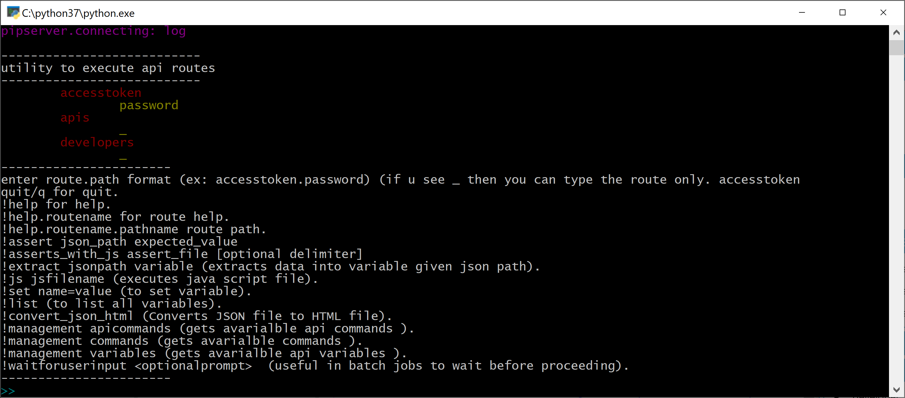

## API Tester

### What it is?
To test REST APIs with validations

### Why another tool?
There are plenty of tools for testing REST APIs (Powershell, PostMan, Insomnia). Each tool adds its own unique value while testing. What I was looking for
is a REPL console tool(for quick test) and rich GUI tool (to view complete request and responses) along with some scenarios (multiple calls chained with validations)

### Architecture
* A __console__ version tool written in __python__ to submit 
requests and responses
* A __GUI__ version tool writtein in __C#__ to view the data
* Using __named pipes__ to communicate between the 2 tools

### Screenshots
#### GUI
  
  

### Terminology
* __api__ 
    * api information where all routes are mapped to simple commands
        * example( apigee)
```json
                "accesstoken": {
                    "baseurl": "https://login.microsoftonline.com/{{tenant_id}}",
                    "_": {
                        "path": "/oauth2/token",
                        "body": {
                            "grant_type": "client_credentials",
                            "client_id": "{{client_id}}",
                            "client_secret": "{{client_secret}}"
                        }
                    }
                }
            }
```
* __scenario__
    * group of commands where each command correspond to api call
        * example (list_developers.txt)
            * \# this file creates acces token and executes apis and gets list of developers
            * accesstoken.password
            * apis
            * developers          
* __environment__
    * list of variables which defines the environment
        * example (sairamaj_accunt.var)
            * org_name=sairamaj-eval
            * username=sairamaj@hotmail.com
            * password=pwdhere
### Structure
```cmd
\Apis
   \Apigee
        config.json
        create-developer.txt
        list_api.txt
        list_deployments.txt
        sairamaj_account.var
   \Azure
        config.json
        get_accesstoken.txt
        sairam_visualstudio_accunt.var
   \Custom
        ...
```
